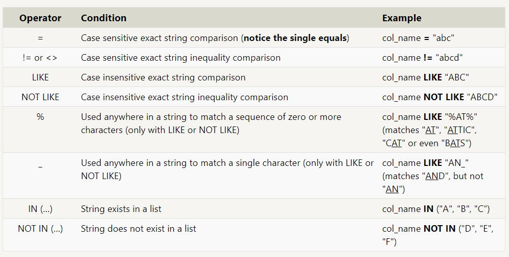

# SQL :
or Structured Query Language, is a language designed to allow both technical and non-technical users query, manipulate, and transform data from a relational database. And due to its simplicity, & thers alot kinf of like: "SQLite, MySQL, Postgres, Oracle and Microsoft SQL" & All of them support the common SQL language standard

## SELECT queries 101:
To retrieve data from a SQL database, we need to write SELECT statements, which are often colloquially refered to as queries witch is just a statement which declares what data we are looking for.., where to find it in the database, and optionally, how to transform it before it is returned..,
```
*Select query for a specific columns*
SELECT column, another_column, …
FROM mytable;
```
the result will be a tow-dimensional: 'rows & columns'of data
```
*Select query for all columns*
SELECT * 
FROM mytable;
```
This query, in particular, is really useful because it's a simple way to inspect a table by dumping all the data at once.

## Queries with constraints:
In order to filter certain results from being returned, we need to use a ***WHERE*** clause in the query. The clause is applied to each row of data by checking specific column values to determine whether it should be included in the results or not
```
Select query with constraints
SELECT column, another_column, …
FROM mytable
WHERE condition
    AND/OR another_condition
    AND/OR …;
```
More complex clauses can be constructed by joining numerous AND or OR logical keywords (ie. num_wheels >= 4 AND doors <= 2). And below are some useful operators that you can use for numerical data (ie. integer or floating point):


>> SQL doesn't require you to write the keywords all capitalized, but as a convention, it helps people distinguish SQL keywords from column and tables names, and makes the query easier to read.



while most database implementations are quite efficient when using these operators, full-text search is best left to dedicated libraries like Apache Lucene or Sphinx. These libraries are designed specifically to do full text search, and as a result are more efficient and can support a wider variety of search features including internationalization and advanced queries..

## Filtering and sorting Query results:
the results of any particular query may not be unique, In such cases, SQL provides a convenient way to discard rows that have a duplicate column value by using the ***DISTINCT*** keyword
```
Select query with unique results
SELECT DISTINCT column, another_column, …
FROM mytable
WHERE condition(s);
```
### Ordering results:
most data in real databases are added in no particular column order. As a result, it can be difficult to read through and understand the results of a query as the size of a table increases to thousands or even millions rows.

To help with this, SQL provides a way to sort your results by a given column in ascending or descending order using the ***ORDER BY*** clause:
```
Select query with ordered results
SELECT column, another_column, …
FROM mytable
WHERE condition(s)
ORDER BY column ASC/DESC;
```
When an ORDER BY clause is specified, each row is sorted alpha-numerically based on the specified column's value. In some databases

### Limiting results to a subset:
is commonly used with the **ORDER BY** clause are the **LIMIT** and **OFFSET** clauses, which are a useful optimization to indicate to the database the subset of the results you care about,
- **The LIMIT** :will reduce the number of rows to return
- & **The OFFSET** :will specify where to begin counting the number rows from..
```
Select query with limited rows
SELECT column, another_column, …
FROM mytable
WHERE condition(s)
ORDER BY column ASC/DESC
LIMIT num_limit OFFSET num_offset;
```
>> websites like Reddit or Pinterest, the front page is a list of links sorted by popularity and time, and each subsequent page can be represented by sets of links at different offsets in the database. Using these clauses, the database can then execute queries faster and more efficiently by processing and returning only the requested content

<br>
<br>
<hr>