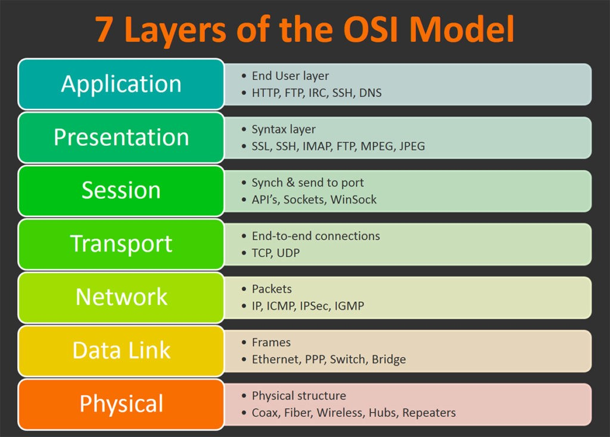

# TCP Servers

## Event Queues

- Much of the NodeJS architecture is built around the use of events.
- All objects that emit events in NodeJS are instances of the EventEmitter constructor.
- EventEmitter’s are a great way to handle controlling asynchronous events.
- Functions can be registered as listeners for an event on instances of the EventEmitter class.
- These instances can emit events and pass the listener’s data.

In practical applications, multiple “disconnected” services can communicate with one another using various protocols using proprietary APIs. Generally, this is done through a central “Hub” server (or Queue) which receives all inbound messages, scrubs the content, and then broadcasts those messages to connected subscribers.

## OSI Model

**The Open Systems Interconnection model (OSI model)** is a conceptual model that characterises and standardises the communication functions of a telecommunication or computing system without regard to its underlying internal structure and technology.

## Internet Protocol Suite

**The Internet Protocol Suite** is the conceptual model for the protocols used by the internet.

- It is often referred to as TCP/IP because the IP and TCP were the original protocols in the suite. The Internet Protocol Suite is described using four layers - Link, Internet, Transport, and Application.
- Web developers often reference the Internet Protocol Suite model when discussing network communication and data exchange.

## Connection Establishment

- The client sends a SYN packet with an random initial sequence number.
- The server sends a SYN-ACK packet with the acknowledgment number set to one more than the initial sequence number.
- The client responds with an ACK and an acknowledgment number incremented by one.

## Connection Termination

- One end sends a FIN Segment and the other sends an ACK segment followed by a FIN segment.
- The termination initiation will then respond with an ACK segment.
